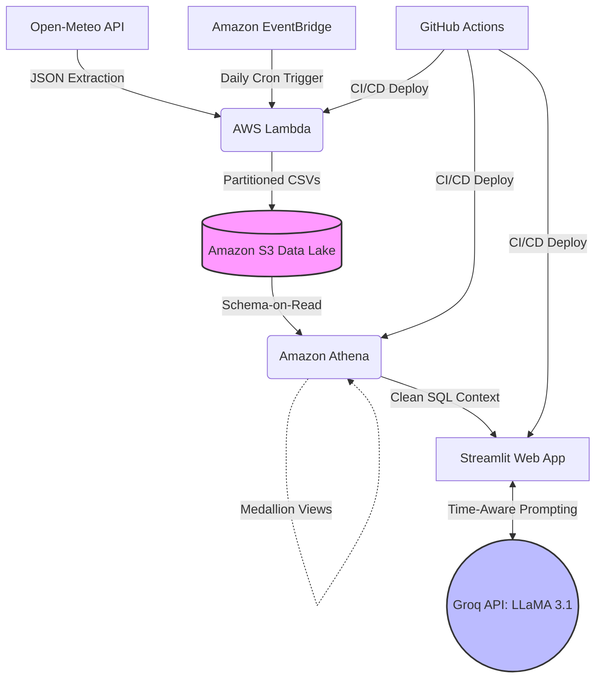

End-to-End-Serverless-Data-Lakehouse-LLaMA-Powered-Travel-Assistant
=======
🌍 Global 50 Cities: AI Weather Oracle

**[🟢 Live Application / Demo](https://cloud-aws-weather-project-9grnnrrrkqiksy55ch2.streamlit.app/)**

A Serverless Medallion Data Lakehouse with AI-Powered Insights
This project is a fully automated, end-to-end data pipeline that ingests global weather and air quality data, processes it through a Medallion Architecture on AWS, and serves an AI-driven dashboard for travel recommendations.

**The Architecture: Medallion Flow**
The project follows the Medallion Architecture to ensure data quality and lineage:

**Bronze (Raw):** Hourly weather and AQI data ingested via AWS Lambda from the Open-Meteo API, stored as JSON/CSV in Amazon S3.

**Silver (Refined):** Data is structured and typed using Amazon Athena views. This layer includes Schema Lineage tracking via the batch_processed_at timestamp.

**Gold (AI Context):** Aggregated daily trends and a "Prompt Payload" view designed specifically for Large Language Model (LLM) consumption.

## 🏗️ System Architecture

⚙️ **Tech Stack & Pipeline Breakdown**

**Zero-Maintenance Partition Projection**
Instead of traditional AWS Glue Crawlers, this project utilizes Athena Partition Projection.

**How it works**: Athena calculates partition locations (Year/Month) on the fly using pre-defined configuration in TBLPROPERTIES.

**Benefit:** Zero metadata lag. New data is queryable the millisecond it hits S3 without running MSCK REPAIR or paying for Crawler runs

**AI Oracle Integration**
Powered by LLaMA 3.1 (8B/70B) via the Groq Cloud API. The dashboard doesn't just show numbers; it interprets them. The Oracle provides clothing suggestions and activity tips based on the 7-day forecast ensemble

1. Data Ingestion & Storage (The S3 Data Lake)
Python & Boto3: A lightweight extraction script querying the Open-Meteo API for 15 granular data points (Temperature, AQI, Precipitation, Solar Radiation).

AWS Lambda & EventBridge: Fully automated, serverless compute triggered on a scheduled CRON job to fetch the latest forecasting data.

Amazon S3: Raw CSVs are partitioned by year and month for optimal query scanning and storage efficiency.

S3 Lifecycle Policies: Implemented automated FinOps rules to purge temporary Athena query logs after 7 days, maintaining a zero-maintenance, cost-effective storage layer.

2. Data Transformation (The Athena Lakehouse)
Amazon Athena (Presto SQL): Serverless query engine used to transform raw S3 files into structured, AI-ready insights.

Schema Evolution: Handled schema drift by building modular CREATE EXTERNAL TABLE and CREATE VIEW scripts to aggregate metrics (e.g., Average AQI, Max Temperatures) into concise context strings.

3. CI/CD & Automation (DataOps)
GitHub Actions: A robust YAML pipeline that automatically deploys Python code to AWS Lambda and executes updated SQL schemas directly in Amazon Athena upon every git push.

4. Frontend UI & Generative AI
Streamlit Community Cloud: A dynamic, interactive Python web application directly connected to the Athena Data Lake.

Pandas & Time-Series Filtering: Custom logic to block past-date selections, ensuring the UI only presents relevant forecasting data to the user.

Groq API (LLaMA 3.1 8B): Integrates the live Athena SQL summaries as system context for the LLM. Engineered prompts force the model to output structured, bulleted travel, clothing, and localized restaurant recommendations based strictly on the current climate.

Streamlit & Plotly: A dynamic dashboard featuring 7-day trend visualizations for Temperature and Air Quality Index (AQI).

Time-Aware Prompt Engineering: Developed a specialized prompt injection layer that feeds the "System Clock" to LLaMA 3.1. This ensures the AI correctly distinguishes between "Today" and "Future Forecasts," eliminating temporal hallucinations.

Groq Inference: Leverages LLaMA 3.1 (8B/70B) via Groq for sub-second inference speeds, providing clothing, health tips, and local activity recommendations.

🧠 Solved Engineering Challenges

Partition Blindness: Resolved issues where Athena failed to recognize new S3 data by implementing automated partition discovery and fixing root-folder mapping.

Data Integrity: Identified and mitigated "Schema Mismatch" errors caused by stray files in the S3 root, ensuring strict adherence to the partitioning strategy.

Temporal Logic: Fixed AI "Future Hallucinations" by implementing a Python-based date-comparison layer that adjusts the AI's tense (Past/Present/Future) based on the user's selection.

🛠️ Key Technical Features
1. The Medallion Data Model (SQL)
Data is refined across three layers within Amazon Athena to ensure high-quality context for the AI:

Bronze: Raw external tables mapping to partitioned S3 CSVs.

Silver: Data cleaning, casting strings to doubles, and timestamp normalization.

Gold: Aggregated daily summaries specifically formatted as "Context Packets" for LLM consumption.

2. Partitioning & Cost Optimization
Implemented Hive-Style Partitioning (year=2026/month=03/) in S3.

Reduced Athena scan costs by ~90% by isolating queries to specific time-bound prefixes.

3. Temporal Prompt Engineering
Solved "Time Hallucination" issues where LLMs struggle with current vs. future dates.

Solution: Injected real-time India Standard Time (IST) into the system prompt, enabling the model to distinguish between historical data and future forecasts.

4. Defensive DataOps
Built-in Value Validation in Streamlit to handle NaN (Not a Number) values from the API (common in Air Quality forecasts).

CI/CD: Automated Lambda and Streamlit deployments via GitHub Actions.

🚀 Tech Stack
Infrastucture: AWS (Lambda, S3, Athena, EventBridge, IAM)

Languages: Python (Boto3, Pandas, Open-Meteo API)

AI/ML: LLaMA 3.1 via Groq (Inference Optimization)

Frontend: Streamlit Cloud

Automation: GitHub Actions

📈 Dashboard Preview
The dashboard includes:

System Health Checks: Real-time monitoring of Data Lake freshness.

Trend Analysis: 7-Day interactive charts for Temperature and AQI.

The Oracle: An AI agent that provides predictive travel advice based on specific data points.

🔮 Future Roadmap
[ ] Multi-Region Redundancy: Deploying Lambda across multiple AWS regions to ensure 100% API availability.

[ ] Vector Search Integration: RAG-enhanced activity recommendations using a vector database for specific city landmarks.

[ ] Advanced Monitoring: Integrating AWS CloudWatch Alarms for Lambda execution failures or S3 ingestion delays.

