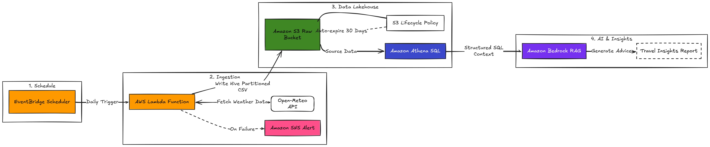

# cloud-weather-project
# 🌦️ Serverless AI Weather Oracle & Data Lakehouse
**AWS Cloud Architecture | Data Engineering | Multi-Cloud GenAI (RAG)**



A production-ready, event-driven data pipeline that automates the collection of global weather data, stores it in a partitioned S3 Data Lake, and utilizes a Multi-Cloud AI strategy to provide natural language travel insights via Llama 3.1.

---

## 🏗️ The Architecture

This project implements a Modern Data Lakehouse pattern using serverless AWS services, integrated with high-performance AI inference.

- **Ingestion:** AWS Lambda (Python 3.12) fetches 14-day snapshots (History + Forecast) from the Open-Meteo API.
- **Orchestration:** Amazon EventBridge triggers the ingestion daily at a cost-optimized rate.
- **Storage (Data Lake):** Amazon S3 organized with Hive-style Partitioning (`year/month`) for high-performance querying.
- **Data Warehouse:** Amazon Athena provides a SQL interface over raw S3 CSV files using Schema-on-Read.
- **AI Intelligence (RAG):** A secondary Lambda acts as an AI Oracle, querying Athena SQL aggregates and passing context to Llama 3.1 (via Groq) for sub-second natural language reasoning.

---

## 🚀 Technical Highlights

### 1. Multi-Cloud AI Resiliency
Initially designed for Amazon Bedrock, the AI layer was migrated to Groq (Llama 3.1 8B) to optimize for token quotas and sub-second inference latency. This demonstrates a **Vendor-Agnostic Architecture** capable of switching LLM providers via API integration.

### 2. Retrieval-Augmented Generation (RAG)
Instead of relying on an LLM's static training data, this pipeline feeds real-time SQL aggregates from Athena into the AI model. This ensures the "Oracle" provides factual, data-driven travel advice based on current atmospheric conditions.

### 3. Big Data Partitioning
I implemented S3 Partitioning (`raw_data/year=YYYY/month=MM/`). This allows Athena to "prune" data, scanning only the necessary folders. This is an enterprise-standard technique for managing petabyte-scale data lakes cost-effectively.

### 4. Live Automated Ingestion
The `DailyWeatherExtraction` EventBridge rule is perfectly active with a `rate(1 day)` schedule. This is the **heartbeat** of the project — it ensures the data lake grows every single day with fresh weather snapshots, making the AI Oracle's insights continuously up-to-date.

---

## 📊 SQL Transformation Layer

I developed a Refined View to transform raw strings into queryable timestamps and AI-ready summaries:

```sql
CREATE OR REPLACE VIEW weather_ai_training AS
SELECT 
    obs_date,
    'Forecast for London: High ' || CAST(MAX(temperature) AS VARCHAR) || '°C, Low ' || CAST(MIN(temperature) AS VARCHAR) || '°C.' as ai_summary
FROM weather_refined
GROUP BY obs_date;
```

---

## 🛠️ Tech Stack

| Category | Technology |
|---|---|
| Cloud Provider | AWS (Lambda, S3, Athena, EventBridge, IAM) |
| AI Inference | Groq Cloud (Llama 3.1 8B Instant) |
| Languages | Python 3.12, SQL |
| Frameworks | Boto3 (AWS SDK), REST API Integration |

---

## 🛤️ Future Roadmap

- **Observability:** Implement Amazon SNS for automated "On-Failure" email alerts.
- **FinOps:** Set S3 Lifecycle Policies to automate data expiration and cost control.
- **Frontend:** Develop a simple web UI to display AI-generated travel advice.
