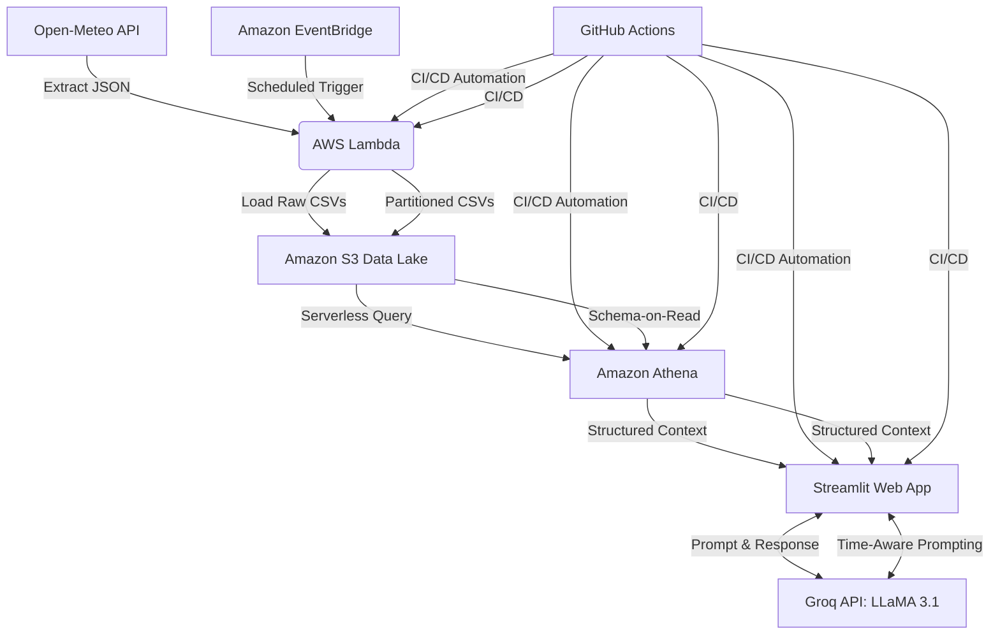

<<<<<<< End-to-End-Serverless-Data-Lakehouse-LLaMA-Powered-Travel-Assistant
=======
🌍 Global 50 Cities: AI Weather Oracle
An End-to-End Serverless Data Lakehouse & LLaMA-Powered Travel Assistant

**[🟢 Live Application / Demo](https://cloud-aws-weather-project-9grnnrrrkqiksy55ch2.streamlit.app/)**
>>>>>>> c6c0dbf4ab1d0b0c0e57f273570ecb7e30f5a4d6

This architecture demonstrates advanced Cloud Engineering, automated DataOps, and GenAI prompt engineering, operating entirely on scalable, low-cost serverless infrastructure.

## 🏗️ System Architecture

⚙️ Tech Stack & Pipeline Breakdown
1. Data Ingestion & Storage (The S3 Data Lake)
Python & Boto3: A lightweight extraction script querying the Open-Meteo API for 15 granular data points (Temperature, AQI, Precipitation, Solar Radiation).

AWS Lambda & EventBridge: Fully automated, serverless compute triggered on a scheduled CRON job to fetch the latest forecasting data.

Amazon S3: Raw CSVs are partitioned by year and month for optimal query scanning and storage efficiency.

S3 Lifecycle Policies: Implemented automated FinOps rules to purge temporary Athena query logs after 7 days, maintaining a zero-maintenance, cost-effective storage layer.

2. Data Transformation (The Athena Lakehouse)
Amazon Athena (Presto SQL): Serverless query engine used to transform raw S3 files into structured, AI-ready insights.

Schema Evolution: Handled schema drift by building modular CREATE EXTERNAL TABLE and CREATE VIEW scripts to aggregate metrics (e.g., Average AQI, Max Temperatures) into concise context strings.

3. CI/CD & Automation (DataOps)
GitHub Actions: A robust YAML pipeline that automatically deploys Python code to AWS Lambda and executes updated SQL schemas directly in Amazon Athena upon every git push.

4. Frontend UI & Generative AI
Streamlit Community Cloud: A dynamic, interactive Python web application directly connected to the Athena Data Lake.

Pandas & Time-Series Filtering: Custom logic to block past-date selections, ensuring the UI only presents relevant forecasting data to the user.

Groq API (LLaMA 3.1 8B): Integrates the live Athena SQL summaries as system context for the LLM. Engineered prompts force the model to output structured, bulleted travel, clothing, and localized restaurant recommendations based strictly on the current climate.

🧠 Future Enhancements
[ ] Integrate AWS Glue Crawlers for automated schema detection.

[ ] Add a visual data dashboard using Plotly for temperature trending.

<<<<<<< HEAD
[ ] Expand to 100 cities with dynamic API pagination.
=======
Streamlit & Plotly: A dynamic dashboard featuring 7-day trend visualizations for Temperature and Air Quality Index (AQI).

Time-Aware Prompt Engineering: Developed a specialized prompt injection layer that feeds the "System Clock" to LLaMA 3.1. This ensures the AI correctly distinguishes between "Today" and "Future Forecasts," eliminating temporal hallucinations.

Groq Inference: Leverages LLaMA 3.1 (8B/70B) via Groq for sub-second inference speeds, providing clothing, health tips, and local activity recommendations.

🧠 Solved Engineering Challenges

Partition Blindness: Resolved issues where Athena failed to recognize new S3 data by implementing automated partition discovery and fixing root-folder mapping.

Data Integrity: Identified and mitigated "Schema Mismatch" errors caused by stray files in the S3 root, ensuring strict adherence to the partitioning strategy.

Temporal Logic: Fixed AI "Future Hallucinations" by implementing a Python-based date-comparison layer that adjusts the AI's tense (Past/Present/Future) based on the user's selection.

🔮 Future Roadmap
[ ] Multi-Region Redundancy: Deploying Lambda across multiple AWS regions to ensure 100% API availability.

[ ] Vector Search Integration: RAG-enhanced activity recommendations using a vector database for specific city landmarks.

[ ] Advanced Monitoring: Integrating AWS CloudWatch Alarms for Lambda execution failures or S3 ingestion delays.

>>>>>>> c6c0dbf4ab1d0b0c0e57f273570ecb7e30f5a4d6
